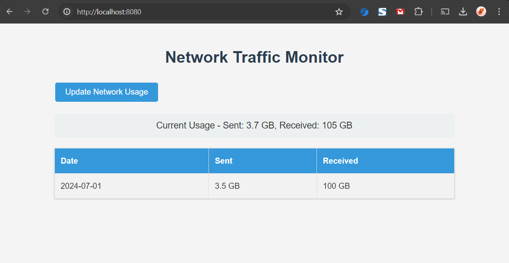

## version: 
3.0

## Description:
Network Traffic Monitor is a real-time web app that tracks and visualizes your internet usage. It displays current download/upload speeds, historical data, and a 30-day summary. With live graphs and easy-to-read stats, it helps users understand their network consumption patterns and monitor bandwidth usage efficiently

## Platforms:
It is currently only supported on Windows. Mac and linux
will be supported in later versions.

Supported Operating System : Windows
Tested only on Windows.

## build step:

Steps to create network monitor : 

1. Run "go mod tidy"
2. Run "go build -o NetworkTrafficMonitor.exe"
3. Open NetworkTrafficMonitor.exe
4. Open http://localhost:8080/ in your browser.

## screenshot:

## TODO
1. Monthly , daily, hourly data tables. 
2. Accurate network usage data.
3. Program should Always run in background. 
4. make Graphs beautiful
5. App based data usage categorization
6. Hosts based data categorization
7. Traffic type  data categorization